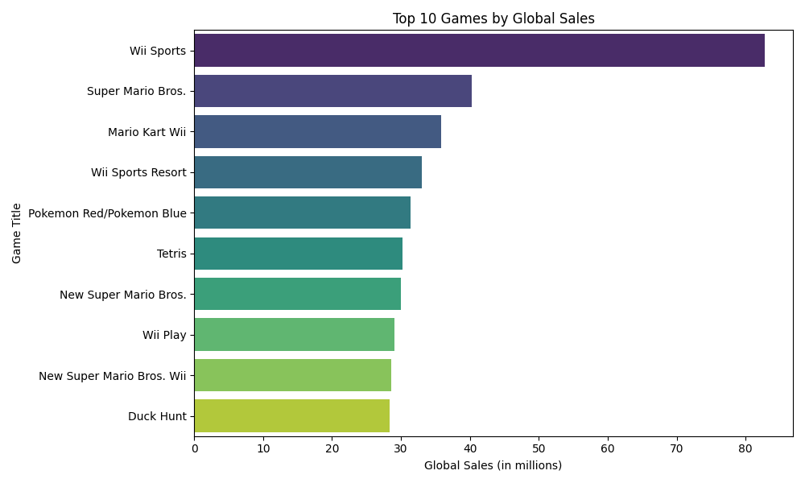
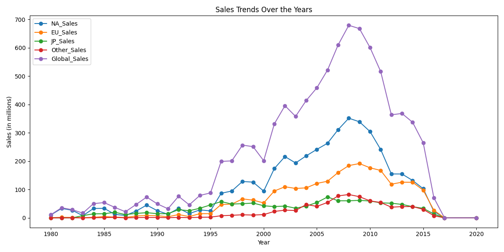
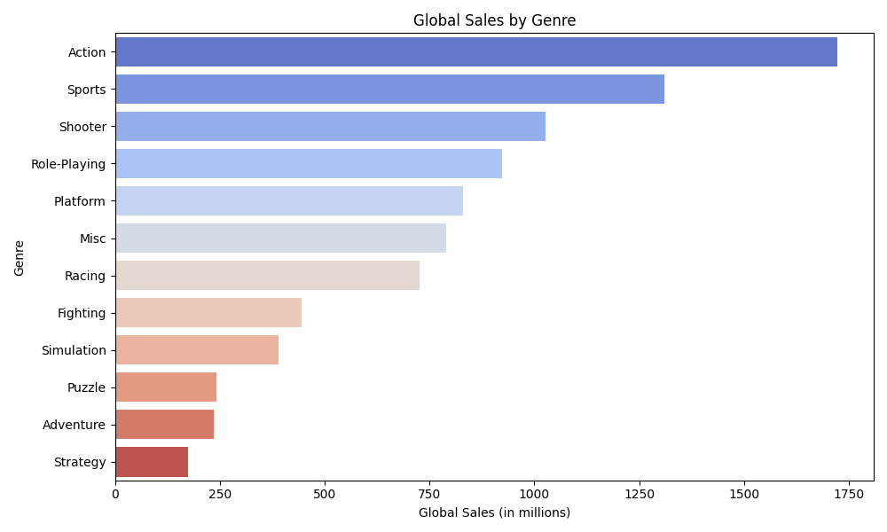
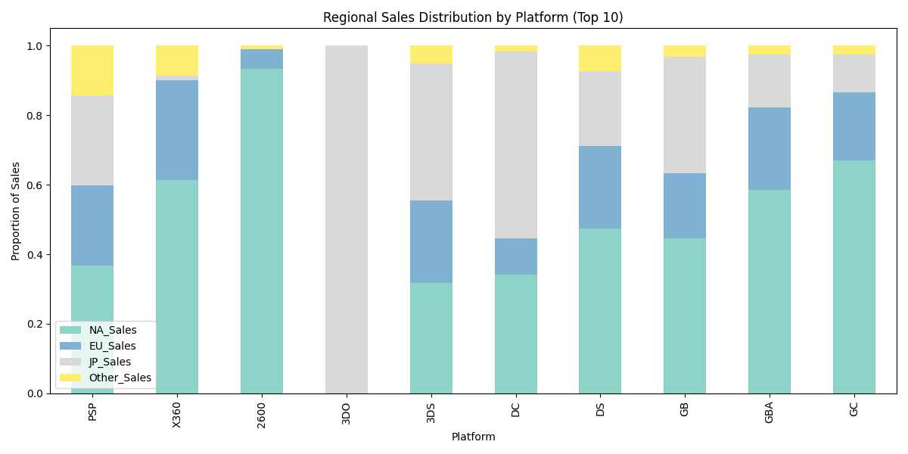
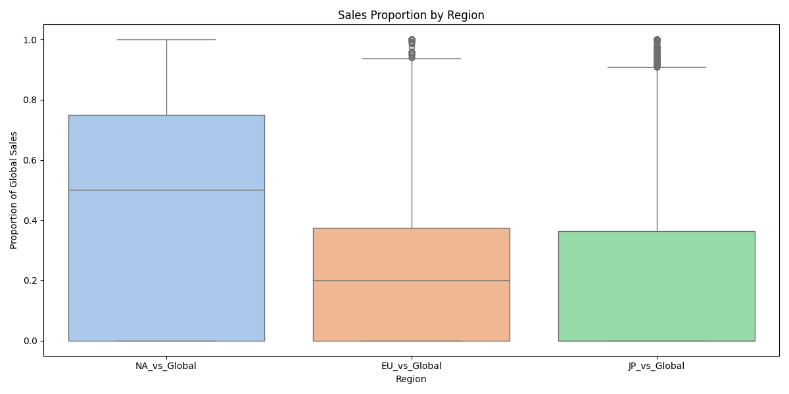

# Video Game Sales Analysis

## Overview
This repository analyzes global video game sales data, examining trends, genre popularity, and regional preferences. By leveraging Python libraries like pandas, matplotlib, and seaborn, we uncover insights and visualize data to address key hypotheses.

## Dataset
**Source:** The dataset, available on [Kaggle](https://www.kaggle.com/datasets/gregorut/videogamesales), was created by Kaggle user **gregorut**. It provides detailed information on video game sales across regions. It includes:
- **Name:** Title of the video game
- **Platform:** Gaming platform (e.g., PS4, Xbox)
- **Year:** Release year
- **Genre:** Game category (e.g., Action, Sports)
- **Publisher:** Publishing company
- **Regional and Global Sales:** Sales in North America, Europe, Japan, other regions, and globally (in millions)

## Hypotheses and Findings

### 1. Top-Selling Video Games Globally
**Hypothesis:** Certain franchises dominate global sales.

**Result:**
The top 10 games by global sales are shown below. Franchises like *Wii Sports* and *Mario* titles dominate.

### 2. Trends in Sales Over the Years
**Hypothesis:** Video game sales peaked during specific periods, such as the 2000s.

**Result:**
Global sales showed a sharp increase during the early 2000s, coinciding with the rise of platforms like PlayStation 2 and Nintendo Wii.

### 3. Genre Popularity Globally
**Hypothesis:** Action and Sports are the most popular genres globally.

**Result:**
Sports and Action games lead in global sales, while genres like Puzzle and Adventure show smaller contributions.

### 4. Regional Preferences by Platform
**Hypothesis:** Platform preferences vary significantly across regions.

**Result:**
Platforms like NES and Wii dominate in North America, while PlayStation consoles perform better in Europe and Japan.

### 5. Sales Proportion by Region
**Hypothesis:** North America contributes the most to global sales.

**Result:**
North America leads in sales contributions, followed by Europe, with Japan showing lower contributions for most games.

## Tools and Libraries
- **Python Libraries:** pandas, numpy, matplotlib, seaborn
- **Visualization:** Graphs saved as PNG files for easy inclusion in reports or presentations

## Conclusion
This analysis highlights:
- Regional and genre-based trends in video game sales.
- Insights into the dominance of specific platforms and genres globally.
